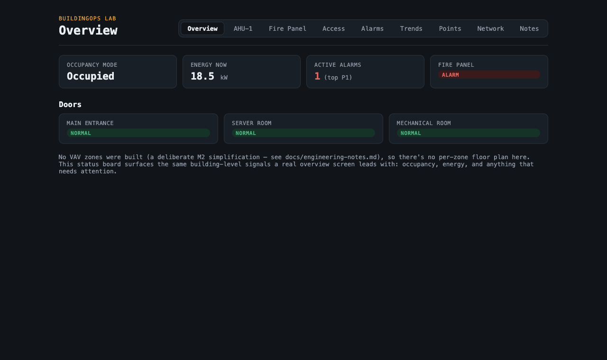
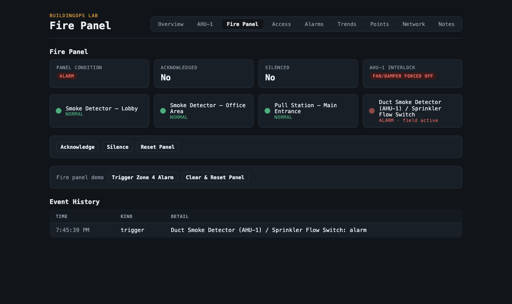
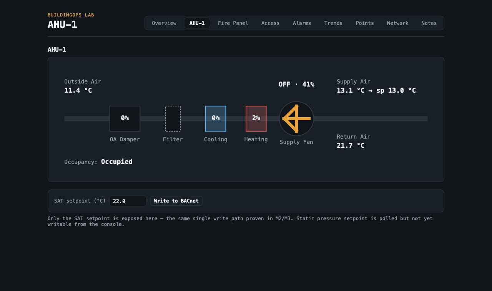
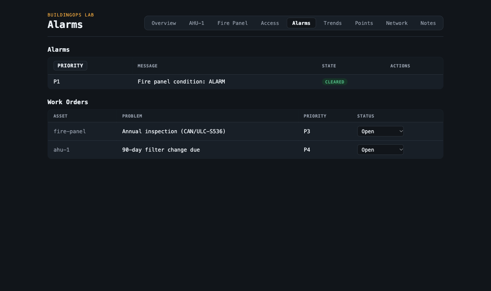
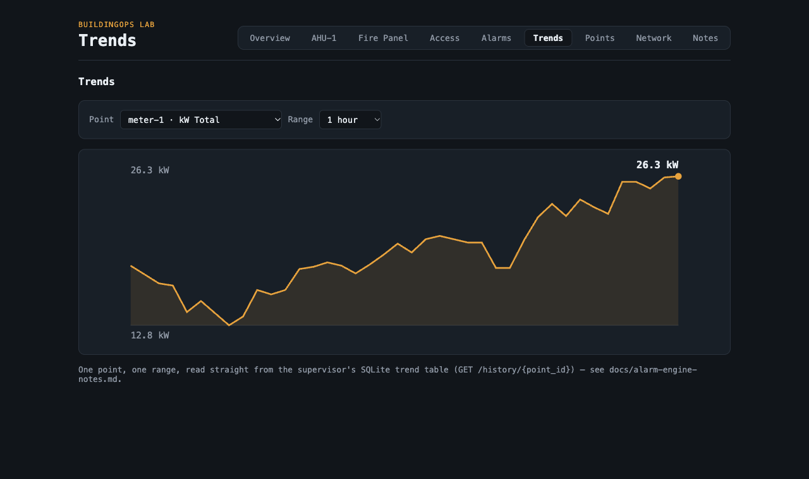
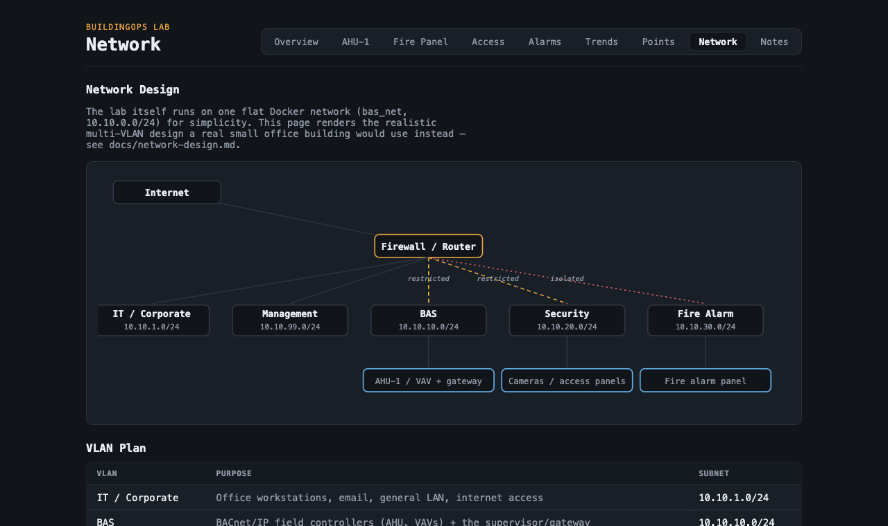

# BuildingOps Lab

[](https://github.com/DanielGarciaGuillen/bas/actions/workflows/ci.yml)

A simulated small office building — HVAC, an energy meter, a fire alarm panel, and access
control — speaking real protocols (BACnet/IP, Modbus TCP), normalized by a gateway, and
exposed through a React console.

**Everything here is simulated. No real equipment, no internet exposure.**

> ⚠️ Simulation only. Real fire alarm systems are life-safety systems governed by the Fire
> Code and CAN/ULC standards, and must only be worked on by qualified, registered
> technicians. See [`docs/fire-alarm-notes.md`](docs/fire-alarm-notes.md).

## Status

**M0–M10 done.** Modbus meter, BACnet AHU-1 with a real PI-loop sequence of operation, a
fire alarm panel whose alarm shuts the AHU down via a BACnet priority override, access
control with per-door/per-cardholder access decisions, an alarm engine with trend history
and work orders, and a nine-tab operator console (Overview, AHU-1, Fire Panel, Access,
Alarms, Trends, Points, Network, Notes). Design decisions and debugging notes live in the
console's **Notes** tab and [`docs/engineering-notes.md`](docs/engineering-notes.md); a
shot-by-shot demo walkthrough is in [`docs/demo-script.md`](docs/demo-script.md).

## Screenshots

| | |
|---|---|
|  Overview |  Fire Panel, mid-alarm |
|  AHU-1, fan forced off by the interlock |  Alarms + Work Orders |
|  Trends |  Network design |

## Running it

```
docker compose up --build modbus-meter bacnet-devices fire-panel access-control gateway console
```

- Console: `http://localhost:5173` — Overview, an AHU-1 schematic with live values and
  setpoint writes, a fire panel annunciator, an access control panel, a sortable alarms +
  work orders view, a trend chart, a raw points table, a network design page, and the
  Notes tab
- Gateway API docs: `http://localhost:8000/docs`

Local dev without Docker: `cd console && pnpm install && pnpm run dev`.

## Architecture

```
 [AHU-1 BACnet] [Meter Modbus] [Fire Panel REST] [Access Control REST]
                        └──────────► [Gateway :8000] ──► [Console :5173]
```

One Docker network stands in for what a real site splits across VLANs. Full breakdown:
[`docs/architecture.md`](docs/architecture.md).

## Docs

- [`docs/architecture.md`](docs/architecture.md) — how the pieces fit together
- [`docs/sequences-of-operation.md`](docs/sequences-of-operation.md) — HVAC control logic in plain English
- [`docs/network-design.md`](docs/network-design.md) — VLANs, IP plan, ports & firewall rules
- [`docs/modbus-register-map.md`](docs/modbus-register-map.md) — energy meter register map
- [`docs/bacnet-points-list.md`](docs/bacnet-points-list.md) — BACnet points list
- [`docs/fire-alarm-notes.md`](docs/fire-alarm-notes.md) — panel states, interlock, disclaimer
- [`docs/access-control-notes.md`](docs/access-control-notes.md) — doors, cardholders, access decisions
- [`docs/alarm-engine-notes.md`](docs/alarm-engine-notes.md) — alarm rules, lifecycle, work orders
- [`docs/engineering-notes.md`](docs/engineering-notes.md) — design decisions, debugging notes
- [`docs/demo-script.md`](docs/demo-script.md) — shot-by-shot demo video script
- [`docs/linkedin-post.md`](docs/linkedin-post.md) — draft announcement post

## Tech stack

| Layer | Choice |
|---|---|
| Device sims | Python 3.12, bacpypes3, pymodbus |
| Gateway | Python, FastAPI |
| Console | React 19, TypeScript 7, Vite 8, pnpm |
| Lint/format | ruff (Python), oxlint + oxfmt (console) |
| Tests | pytest, Vitest |
| Orchestration | Docker Compose |

## Project summary (resume-ready)

- Built a simulated small-office BAS from protocol up — BACnet/IP and Modbus TCP device
  simulators, a Python/FastAPI gateway normalizing both into one point model with an
  alarm engine, SQLite trend history, and CMMS-lite work orders, and a React/TypeScript
  operator console with 9 live views.
- Implemented a real fire-alarm-to-HVAC interlock using BACnet's priority-array
  mechanism — a fire alarm forces the AHU's supply fan off and its outside-air damper
  closed at priority 1, verified to survive and then yield back to the normal schedule's
  lower-priority writes, matching how a real fan-shutdown sequence works on site.
- Tuned and debugged a real PI-loop HVAC sequence of operation (supply-air-temperature
  control, economizer logic, duct static pressure control) against a first-order thermal
  model, including diagnosing and fixing an integral-windup bug and a bang-bang limit
  cycle that only showed up running the simulation end-to-end.
