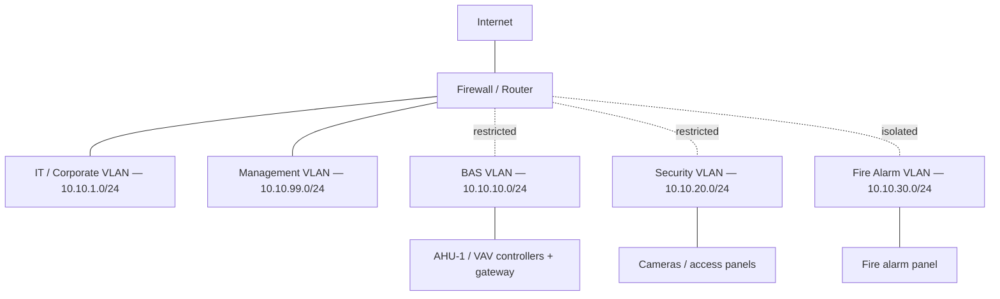

# Network Design (Network+ showcase)

The lab itself runs on one flat Docker network (`bas_net`, `10.10.0.0/24`) for simplicity —
every sim, the gateway, and the console all sit on one bridge (see `docs/architecture.md`).
This document describes the realistic multi-VLAN design a real small office building would
use instead, and is rendered as-is on the console's Network tab.

## VLAN plan

| VLAN | Purpose | Subnet |
|---|---|---|
| IT / Corporate | Office workstations, email, general LAN, internet access | `10.10.1.0/24` |
| BAS | BACnet/IP field controllers (AHU, VAVs) + the supervisor/gateway | `10.10.10.0/24` |
| Security | Cameras, access control panels and card readers | `10.10.20.0/24` |
| Fire Alarm | Panel monitoring/annunciation — kept separate from every other VLAN | `10.10.30.0/24` |
| Management | Switch/AP/UPS out-of-band management | `10.10.99.0/24` |

Each VLAN gets its own subnet and its own default gateway (the `.1` address) on the core
switch/router — no VLAN can reach another except through the rules below.

## IP addressing

- **Static:** BAS field controllers, security panels/cameras, the fire alarm monitoring
  interface, and all management interfaces — the same reason a real building runs them
  static: a controller's address can't drift out from under the supervisor polling it, and
  DHCP lease churn has no upside for a device that never leaves its closet.
- **DHCP:** IT/Corporate workstations and laptops only — the one VLAN where devices
  actually come and go.
- Default gateway per VLAN is the subnet's `.1` address on the core switch; field devices
  get addresses from `.10` upward, leaving `.2`–`.9` for infrastructure (switches, APs).

## Ports & protocols

| Protocol | Port | Notes |
|---|---|---|
| BACnet/IP | UDP 47808 | Broadcast-heavy — see the BBMD note below |
| Modbus TCP | 502 | Unencrypted, unauthenticated by design — never expose beyond the BAS VLAN |
| HTTPS | 443 | Gateway API / console, and vendor cloud dashboards where used |
| MQTT | 1883 / 8883 (TLS) | Stretch goal only — see PLAN.md's stretch list |
| SSH | 22 | Management VLAN only, key-based auth |

## Firewall rules (least privilege)

| From | To | Allowed |
|---|---|---|
| BAS | Supervisor/gateway (BAS VLAN) | BACnet/IP, HTTPS to the gateway's API |
| BAS | Anywhere else | Denied — no internet egress from field controllers |
| Security | NVR / access control server (Security VLAN) | RTSP/ONVIF, the access panel's own protocol |
| Security | Anywhere else | Denied — cameras and readers never need outbound internet |
| Fire Alarm | Monitoring/annunciation workstation only | Vendor-specific monitoring protocol |
| Fire Alarm | Every other VLAN | Denied — fully isolated, matching how a real panel's dedicated circuit never touches the data network |
| Management | BAS / Security / Fire infrastructure (switches, APs, UPS) | SSH, HTTPS |
| IT / Corporate | Internet | Allowed (normal corporate egress) |
| IT / Corporate | BAS / Security / Fire / Management | Denied, except through a jump host with MFA |

## Notes

- **BACnet broadcast behavior and BBMDs:** BACnet/IP devices find each other with
  broadcast frames (`Who-Is`/`I-Am`), and broadcasts don't cross a routed subnet boundary by
  default. A real building with BAS controllers split across more than one IP subnet (e.g.
  one per mechanical room) needs a **BBMD** (BACnet Broadcast Management Device) on each
  subnet to forward broadcasts between them — otherwise devices on different subnets never
  discover each other. This lab's `bas_net` is one flat subnet, so no BBMD is needed here;
  it's a real multi-closet concern this design calls out rather than hides.
- **PoE for cameras and readers:** security cameras and card readers are normally powered
  over the same Ethernet run (802.3af/at/bt) from PoE switches on the Security VLAN — one
  cable per device instead of separate low-voltage power wiring, which is most of why PoE
  switch port count drives closet/IDF planning on a security retrofit.
- **Basic OT security hygiene:** change every controller/panel's default password before
  commissioning; keep BAS/Security/Fire off the general IT LAN entirely (this VLAN plan,
  not just a firewall rule bolted on after the fact); remote access into any OT VLAN only
  through a VPN terminating at a jump host, never a port-forward straight to a controller;
  firmware updates from the vendor's verified source only.

## Diagram

