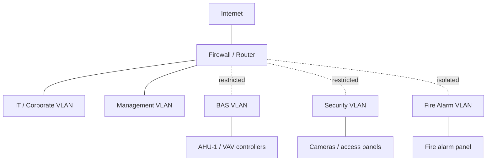

# Network Design (Network+ showcase)

_Status: draft stub — Daniel to review and rewrite in his own words (per PLAN.md §11).
The lab itself runs on one flat Docker network (`bas_net`, 10.10.0.0/24) for simplicity;
this document describes the realistic multi-VLAN design a real building would use._

## VLAN plan

| VLAN | Purpose | Subnet (example) |
|---|---|---|
| IT / corporate | Office workstations, email, general LAN | TODO |
| BAS | BACnet/IP field controllers + supervisor | TODO |
| Security | Cameras, access control panels/readers | TODO |
| Fire alarm monitoring/annunciation | Kept separate from all other OT traffic | TODO |
| Management | Switch/AP/out-of-band management | TODO |

## IP addressing

- TODO: subnets (10.x.x.x /24s), default gateways per VLAN.
- TODO: DHCP vs. static — field controllers are usually static.

## Ports & protocols

| Protocol | Port | Notes |
|---|---|---|
| BACnet/IP | UDP 47808 | Broadcast-heavy; see BBMD note below |
| Modbus TCP | 502 | |
| HTTPS | 443 | Gateway API / console |
| MQTT | 1883 / 8883 (TLS) | Stretch goal only |
| SSH | 22 | Management access only |

## Firewall rules (least privilege)

- TODO: e.g. BAS VLAN → only the supervisor/gateway server; no internet access from
  controllers; Security VLAN → NVR/access server only; Fire VLAN → monitoring station only.

## Notes

- TODO: BACnet broadcast behavior and BBMDs (BACnet Broadcast Management Devices) across
  subnets/routed networks.
- TODO: PoE for cameras/readers.
- TODO: basic OT security hygiene — change default passwords, segment OT from IT, remote
  access via VPN only, no direct internet exposure of controllers.

## Diagram

